#                                Rapport de projet de GL
_____________________________________________________________________________________________
#                           

_____________________________________________________________________________________________

##                                  L3 Informatique

##             Membres du groupe 

              - Sara Lyna OUYAHIA
              - Thibault TISSERAND

  
#                                    Table des matières 
_____________________________________________________________________________________________
                              1- Présentation Globale du projet
                                1.1- Utilité du projet
                                1.2- Description du projet

                              2- Historique du logiciel
                                2.1- Analyse du git

                              3- Architecture logicielle
                                3.1- Utilisation de bibliothèques extérieures
                                3.2- Organisation en paquetages
                                3.3- Répartition des classes dans les paquetages
                                3.4- Organisation des classes

                              4- Analyse approfondie
                                4.1- Tests
                                4.2- Commentaires
                                4.3- Dépréciation
                                4.4- Duplication de code
                                4.5- God Classes
                                4.6- Analyse des méthodes

                              5- Nettoyage de Code et Code smells
                                5.1- Règles de nommage
                                5.2- Nombre magique
                                5.3- Structure du code
                                5.4- Code mort

                              6- Amélioration possibles du projet

_____________________________________________________________________________________________

#                                     Outils utilisés 

Pour l'analyse du projet red5-server, nous avons été amenés à utiliser plusieurs outils et IDE:
  - SonarQube
  - Eclipse
  - IntelliJ
  - CodeMr

##            Partie 1 : Audit du projet (Analyse de la qualité logicielle du projet red5-server)

##                                            Contexte

Pour cette version du projet on s'intéressera à la toute dernière mise à jour datant du mois de février 2024.

- Analyse du projet Red5-Server :  `https://github.com/Red5/red5-server`

##                          1 - Présentation Globale du projet 

### 1.1 - Utilité du projet

- Ce dépot contient le code source du projet Red5-Server . Il s'agit de :
Red5 est un serveur Flash gratuit et libre qui reprend les fonctionnalités de Flash Media Server de Adobe.

- Il permet de faire du streaming audio ou vidéo, partage d'objet distant (remoting), de la synchronisation de données, etc. Contrairement à Flash Media Server 2, les applications côté serveur peuvent être écrites en Java mais aussi avec d’autres langages de script comme JavaScript, Ruby, Python, …

- `english version`
Red5 is an Open Source Flash Server written in Java that supports:
  - Streaming Video (FLV, F4V, MP4, 3GP)
  - Streaming Audio (MP3, F4A, M4A, AAC)
  - Recording Client Streams (FLV and AVC+AAC in FLV container)
  - Shared Objects
  - Live Stream Publishing
  - Remoting
  - Protocols: RTMP, RTMPT, RTMPS, and RTMPE

  
Pour lancer le projet on peut compter sur ces commandes : 

- Cela créera les fichiers jars dans le répertoire "cible" de l'espace de travail et sautera également les tests unitaires :
`mvn -Dmaven.test.skip=true install`

- Pour regrouper tout dans une assemblée (tarball/zip) :
`mvn -Dmaven.test.skip=true clean package -P assemble`

- Pour construire une version intermédiaire (milestone) en tarball :
`mvn -Dmilestone.version=1.0.7-M1 clean package -Pmilestone`

- Pour créer les fichiers de projet Eclipse, exécutez ceci dans le répertoire red5-server :
`mvn eclipse:eclipse`

- Le projet est bien décrit dans le [readme](https://github.com/Red5/red5-server/blob/master/README.md), on sait exactement ce qu'il fait .

### 1.2 - Description du projet

- Le [readme](https://github.com/Red5/red5-server/blob/master/README.md) est pertinent et complet. Il contient une description du projet, les commandes maven pour installer et lancer le projet.
 Il contient aussi les commandes pour build le projet depuis la source ainsi que celles pour faire fonctionner le projet dans Eclipse. Une liste des anciennes versions est également disponible dans le readme.
Le fichier readme est écrit de manière à guider l’utilisateur à installer la librairie sur son projet à lui,et non à le modifier, dans ce sens le readme est très pertinent pour un utilisateur de la librairie. 

- La documentation est pertinente et complète. 
Elle se situe dans le [wiki](https://github.com/Red5/red5-server/wiki) du projet sur github.
Le wiki contient 23 catégories avec chacune des sous parties. Il y a des parties pour l'installation sous Linux et sous MacOS, pour les erreurs communes, les protocoles de transmission, pour un démarrage rapide avec le projet et une documentation sur la dernière version.

- Il manque peut-etre l'UML mais rien de bien méchant.

##                              2 - Historique du logiciel

### 2.1 - Analyse du git
Au total dans le projet Red5-Server, on a répertorié plusieurs contributeurs,
et également trouvé leur contact (@mail).
- Nombre de contributeurs de Red5-Server : 14
  - Luke Hubbard (<luke@codegent.com>)
  - Dominick Accattato (<daccattato@gmail.com>)
  - Chris Allen (<mrchrisallen@gmail.com>)
  - Joachim Bauch (<jojo@struktur.de>)
  - Mick Herres (<mickherres@hotmail.com>)
  - John Grden (<johng@acmewebworks.com>)
  - Grant Davies (<grant@bluetube.com>)
  - Steven Elliott (<steven.s.elliott@gmail.com>)
  - Jokul Tian (<tianxuefeng@gmail.com>)
  - Steven Gong (<steven.gong@gmail.com>)
  - Paul Gregoire (<mondain@gmail.com>)
  - Michael Klishin (<michael.s.klishin@gmail.com>)
  - Thijs Triemstra (<info@collab.nl>)
  - Dan Rossi (<electroteque@gmail.com>)
  - Anton Lebedevich (<mabrek@gmail.com>)
  - Art Clarke (<aclarke@xuggle.com>)
  - Tiago Daniel Jacobs (<tiago@imdt.com.br>)

- Sponsor du projet : Le projet ne possède aucun sponsor,
puisque (`ko-fi.com/mondain`) n'étant pas considéré comme un sponsor.

- Nombre de commits total : on a compté au total 622 commits en date du (15/02/2024).
Sur l'image on remarque bien que la période ou les commits étaient réguliers et en grosse quantité
était entre 2014 et 2016.
Ce qui est étonnant car le projet a démarré en Septembre 2005 et il est diffusé sur GitHub depuis 2008.
On en déduit donc que depuis 2005 jusqu'à aujourd'hui plusieurs centaines de personnes essaient de résoudre les différents bugs du logiciel.

- Les différents contributeurs contribuent de façon non équilibré dans le temps,
 en effet ils s'arrêtent de contribuer à un certain moment,
 par exemple il a été créé en 2005 puis diffusé sur GitHub en 2008, mais n'empeche la plus forte affluence de commits était en 2014-2016,
 mais le projet reste actif car il ya d’autres contributeurs nouveaux qui prennent le relais.

- Issues : on en a 36 ouverts en date du (15/02/2024) et 215 ont été fermées car problèmes réglés.

- Pull-Request : 5 ouverts au jour d'aujourd'hui, et 88 fermés.
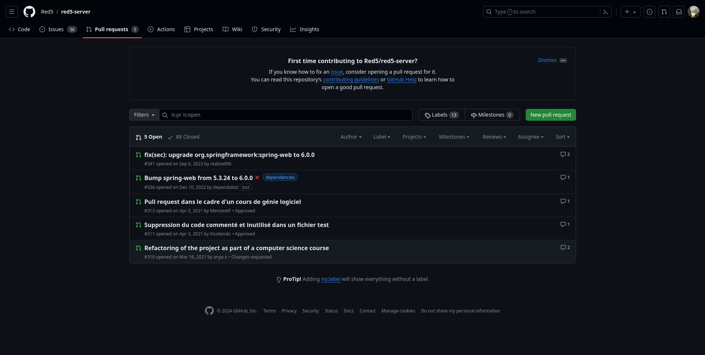

La plus part de ces pull-request sont du refactoring de code, de la suppression, correction de bugs ...etc

- on peut remarquer que `ko-fi.com/mondain` est bel et bien le contributeur principal,

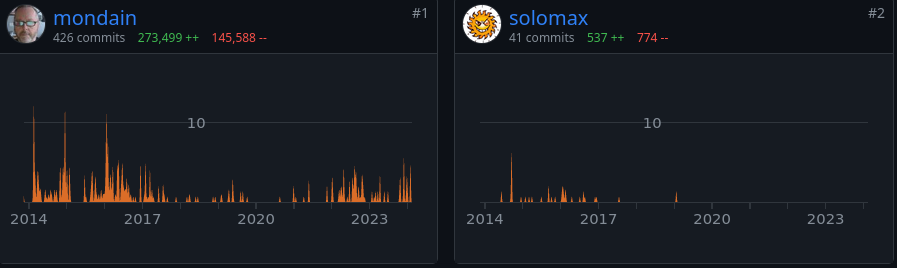,

un site spécial pour que tout le monde puisse corriger les bugs en open source.

- Le projet est toujours actif à l'heure d'aujourd'hui,le dernier commit date d'une semaine, pour un projet de cette envergure on peut dire qu'il est assez bien maintenu.

- Au total il y a huit branches distinctes :
  - master : la branche par défaut qui est d'ailleurs toujours active au jour d'aujourd'hui.
  - snmp : branche ajoutée récemment (une semaine).
  - tc10migrate : branche récente (2 semaines).
  - bug/R5SI-786
  - dependabot/maven/org.springframework-spring-web-6.0.0
  - stable-release
  - epic/GROGU
  - circleci-project-setup

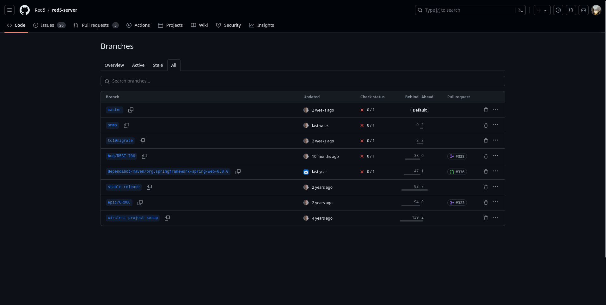

##                               3 - Architecture logicielle

### 3.1 - Utilisation de bibliothèques extérieures

Le projet possède 102 packages exterieurs parmi les 117 packages référencés dans les différents `pom.xml`. Cela représente environ 358 classes externes utilisées par les différentes parties du projet.
On peut remarquer que seulement 15 imports locaux sont fait dans les 6 packages du projet.

- Parmi les packages, il y a 24 dépendances utilisées mais non déclarées, et 24 dépendances déclarées mais non utilisées.

Ci-dessous les différents packages et leurs dépendances :

- red5-parent :
  - Aucune dépendance non utilisée.

- red5-io :
  - Dépendances non déclarées utilisées.:
    - `org.springframework:spring-beans`
  - Des dépendances déclarées mais non utilisées ont été trouvées:
    - `ch.qos.logback:logback-classic:jar:1.4.14:compile`
    - `org.apache.mina:mina-integration-beans:bundle:2.0.23:compile`
    - `org.springframework:spring-context-support:jar:5.3.31:compile`
    - `commons-io:commons-io:jar:2.11.0:compile`
    - `org.springframework:spring-web:jar:5.3.31:compile`
    - `junit:junit:jar:5.0-SNAPSHOT:test`
    - `org.hamcrest:hamcrest-junit:jar:2.0.0.0:test`

- red5-server-common :
  - Dépendances non déclarées utilisées:
    - `ch.qos.logback:logback-core:jar:1.4.14:compile`
    - `org.springframework:spring-beans:jar:5.3.31:compile`
    - `org.springframework:spring-context:jar:5.3.31:compile`
    - `org.springframework:spring-core:jar:5.3.31:compile`
    - `org.apache.httpcomponents:httpcore:jar:4.4.16:compile`
  - Des dépendances déclarées mais non utilisées ont été trouvées:
    - `org.springframework:spring-test:jar:5.3.31:test`
    - `org.springframework:spring-context-support:jar:5.3.31:compile`
    - `junit:junit:jar:5.0-SNAPSHOT:test`

- red5-service :
  - Dépendances non déclarées utilisées:
    - Aucune
  - Des dépendances déclarées mais non utilisées ont été trouvées:
    - `org.slf4j:slf4j-api:jar:2.0.11:compile`
    - `ch.qos.logback:logback-core:jar:1.4.14:compile`

- red5-server :
  - Dépendances non déclarées utilisées:
    - `ch.qos.logback:logback-core:jar:1.4.14:compile`
    - `commons-beanutils:commons-beanutils:jar:1.9.4:compile`
    - `org.springframework:spring-beans:jar:5.3.31:compile`
    - `org.apache.tomcat:tomcat-websocket-api:jar:8.5.95:provided`
    - `org.bouncycastle:bcprov-jdk15on:jar:1.62:compile`
    - `org.springframework:spring-web:jar:5.3.31:compile`
    - `commons-codec:commons-codec:jar:1.13:compile`
    - `org.apache.mina:mina-core:bundle:2.0.23:compile`
    - `org.apache.commons:commons-lang3:jar:3.11:compile`
  - Des dépendances déclarées mais non utilisées ont été trouvées:
    - `org.red5:red5-service:jar:1.3.27:provided`
    - `org.red5:red5-service:tar.gz:daemon:1.3.27:runtime`
    - `org.slf4j:jcl-over-slf4j:jar:2.0.11:compile`
    - `org.slf4j:log4j-over-slf4j:jar:2.0.11:compile`
    - `org.springframework:spring-context-support:jar:5.3.31:compile`
    - `org.springframework:spring-webmvc:jar:5.3.31:compile`
    - `org.apache.mina:mina-integration-beans:jar:2.0.23:compile`
    - `net.sf.ehcache:ehcache:jar:2.10.6:compile`
    - `org.mp4parser:isoparser:jar:1.9.39:compile`
    - `org.apache.tomcat.embed:tomcat-embed-jasper:jar:8.5.95:provided`
  - Des dépendances spécifiées uniquement pour les tests mais non affectées à une portée de test ont été trouvées:
    - `commons-beanutils:commons-beanutils:jar:1.9.4:compile`

- red5-client :
  - Dépendances non déclarées utilisées:
    - `ch.qos.logback:logback-core:jar:1.4.14:compile`
    - `org.slf4j:slf4j-api:jar:2.0.11:compile`
    - `org.apache.httpcomponents:httpclient:jar:4.5.14:compile`
    - `org.springframework:spring-context:jar:5.3.31:compile`
    - `org.springframework:spring-core:jar:5.3.31:compile`
    - `org.red5:red5-io:jar:1.3.27:compile`
    - `org.apache.httpcomponents:httpcore:jar:4.4.16:compile`
    - `org.bouncycastle:bcprov-jdk15on:jar:1.62:compile`
    - `commons-codec:commons-codec:jar:1.13:compile`
  - Des dépendances déclarées mais non utilisées ont été trouvées:
    - `junit:junit:jar:5.0-SNAPSHOT:test`
    - `net.sf.ehcache:ehcache:jar:2.10.6:runtime`

On peut constater que des dépendances non déclarées sont présentes dans certains modules, ce qui peut poser des problèmes de maintenance et de compatibilité à long terme.
Il y a aussi la présence de  dépendances déclarées qui sont présentes mais non utilisées dans plusieurs modules, ce qui donne potentiellement des opportunités d'optimisation et de nettoyage du code.
Parmi les dépendances qui reviennent souvent dans la liste de celles inutilisées, on remarque que `junit` apparait 3 fois, ce qui laisse penser que les tests ne sont pas encore écrits mais prévus.

Les bibliothèques réellement utilisées ne nous apprennent pas plus d'informations sur le projet, elles correspondent à la description des fonctionnalités du projet. 
Il y a néanmoins l'utilisation de plusieurs bibliothèques pour des fonctionnalités similaires, telles que les bibliothèques de log `slf4j-api` et `logback-classic,` qui semble être justifiée, car elles offrent chacune des fonctionnalités complémentaires ou des intégrations avec d'autres outils ou frameworks.

### 3.2 - Organisation en paquetages 

- Le nombre de packages total : il y a 5 packages principaux au total dans projet parent (red5-parent):
   - red5-client
   - red5-io
   - red5-server
   - red5-server-common
   - red5-service
  Mais on a également le package :
   - red5-servlet, qui gère l'HTML, on citera juste ce qu'il fait mais il ne sera pas étudié en détails car ce n'est pas un package principal.

Les différents packages ont chacun un role principal dans la création de ce projet,
ils gèrent tout du début jusqu'à la fin, du server aux clients en passant par les différents
services qu'ils proposent.

- Les liens entre les packages :
  - Par exemple pour red5-server-common, ce package contient les classes communes aux serveurs Red5, le code contenu dedans est commun aux projets red5-server et red5-client.
 Ce code vise à éliminer les frais généraux du contenu du serveur dans le projet client.
 Il peut être utilisé par Server pour accéder à des fonctionnalités communes nécessaires à son fonctionnement, tout en étant également accessible aux clients pour une utilisation côté client.

  - Concernant red5-io, il s'agit de la bibliothèque de base pour les entrées/sorties au sein des projets Red5 (serveur et client).

  - red5-client, utilise les fonctionnalités fournies par les paquetages io et service pour communiquer avec le serveur Red5 et accéder aux différents services offerts.

  - red5-server, utilise les fonctionnalités fournies par io pour gérer les connexions entrantes et sortantes, ainsi que pour traiter les flux de données transmis entre le serveur et les clients.

  - red5-service, utilise des fonctionnalités fournies par io pour gérer le flux de données lors du streaming audio et vidéo, ainsi que pour l'enregistrement de flux client et la publication de flux en direct.

  - red5-servlet, peut interagir avec server et service pour fournir des fonctionnalités Web au serveur Red5, telles que des interfaces utilisateur ou des fonctionnalités d'administration à distance.

- Les noms des packages :

  - red5-client : on peut comprendre que c'est le package qui gère les clients du serveur Red5 ,il est responsable de la communication entre le serveur et les clients, ainsi que de la gestion des différentes versions automatisées qui peuvent être trouvées à l'adresse: <https://builds.apache.org/view/M-R/view/OpenMeetings/job/Red5-client/>

  - red5-server : ce package est dédié à la gestion des serveurs de sockets. Il contient probablement le cœur du serveur Red5, gérant les connexions entrantes, les flux de données et les différentes fonctionnalités offertes par le serveur.

  - red5-server-common : contient du code commun aux serveurs Red5 et aux clients. Son objectif principal est de réduire les frais généraux du contenu du serveur dans le projet client. Il fournit probablement des fonctionnalités partagées nécessaires à la fois aux serveurs et aux clients.

  - red5-io : ce package est crucial pour les entrées/sorties au sein des projets Red5 (serveur et client). Il contient les sockets et les contrôleurs nécessaires à la communication entre les différents composants du serveur Red5, ainsi qu'à la gestion des flux de données.
  La liste des utilisateurs peut être trouvée ici: <https://groups.google.com/forum/#!forum/red5interest>
  Les versions automatisées peuvent être trouvées ici: <https://builds.apache.org/view/M-R/view/OpenMeetings/job/Red5-io/>

  - red5-service : ce package gère les différents services proposés par le serveur Red5. Il est responsable de la mise en œuvre des fonctionnalités telles que le streaming vidéo et audio, l'enregistrement de flux client, la publication de flux en direct, etc.

  - red5-servlet : ce package contient les servlets utilisés pour la gestion des requêtes HTTP. Il peut être utilisé pour les fonctionnalités Web du serveur Red5, telles que l'administration à distance ou les interfaces utilisateur, donc ce package n'est pas vraiment intéressant pour la suite de notre analyse, on va plutot se concentrer sur les packages principaux, les plus gros.
  Car celui-la ne contient aucune classe.

Chacun de ces packages joue un rôle spécifique dans le fonctionnement global du serveur Red5, en organisant le code en fonction de ses responsabilités et en facilitant la maintenance et le développement du projet.
L'organisation en paquetages du projet Red5-Server semble être bien structurée, avec des packages clairement définis pour gérer différents aspects du serveur, ce qui contribue à la lisibilité, à la maintenabilité et à la scalabilité du code.

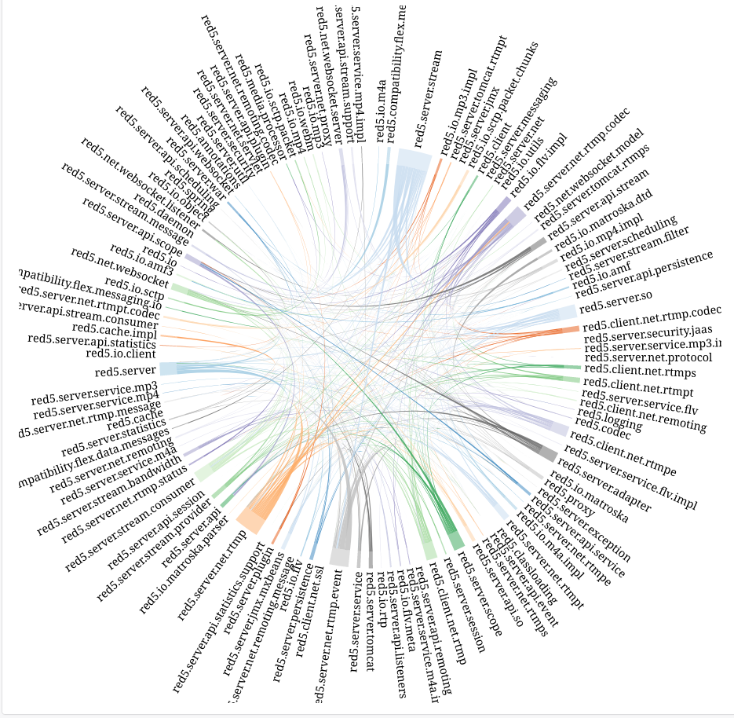

### 3.3 - Répartition des classes dans les paquetages

Tout d'abord afin de mieux comprendre les schémas qui vont suivre voici la légende des couleurs présentent.
|  |
|:--:|
| *La signification des couleurs dans les diagrammes* |

- Le nombre de classes par package :
   - red5-parent : 919 classes au total qui sont répartis dans les packages ci-dessous:
   - red5-client : 134 classes, pour 11 packages.
   - red5-io : 220 classes, pour 33 packages.
   - red5-server : 220 classes, pour 53 packages.
   - red5-server-common : 337 classes, pour 43 packages.
   - red5-service : 8 classes, pour 3 packages.

 Le package le plus gros est  red5-server-common, ce qui est tout a fait normal car c'est la classe qui gère le code commun aux serveurs Red5 et aux clients.
 le nombre minimum de classes dans un package est de : 8
 le nombre maximum de classes dans un package est de : 337
 le nombre moyen de classes dans un package est de : 183 classes (médiane)
 On peut également remarquer que les packages server et io ont le meme nombre de classes.
 

- La répartition des classes dans les différents paquetages :
la majorité des classes se trouve dans le package red5-server-common, 
mais cela permet de mieux identifier le rôle de chaque package puisque, comme indiqué précédemment, les paquetages ont une spécialisation.
et ensuite vient red5-io et red5-server qui ont tout deux 220 classes, logique car ce sont les packages principaux du projet.

- Le couplage et la cohésion au sein des paquetages de quelques uns en
particulier :
Pour le coupling entre les classes de tous le projet on comme référence cette image :

  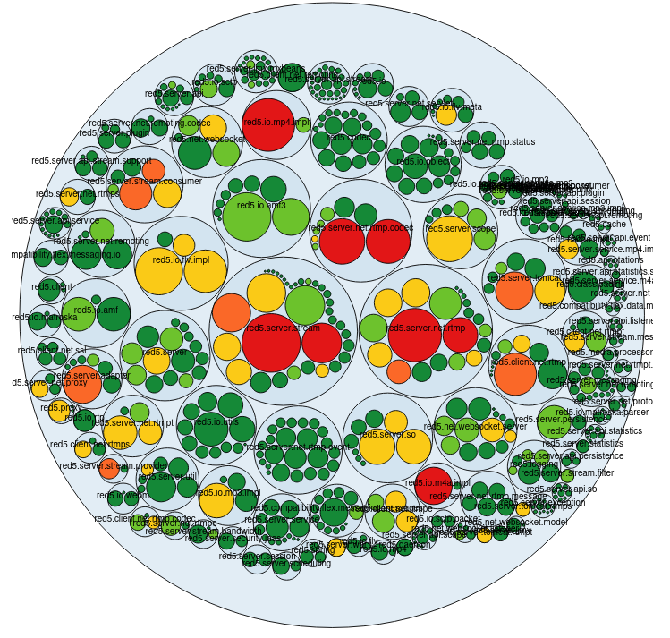

D'après l'analyse, on peut comprendre que la ou il ya du rouge dans l'image, le coupling est vraiment élevé,
on peut prendre comme exemple :

   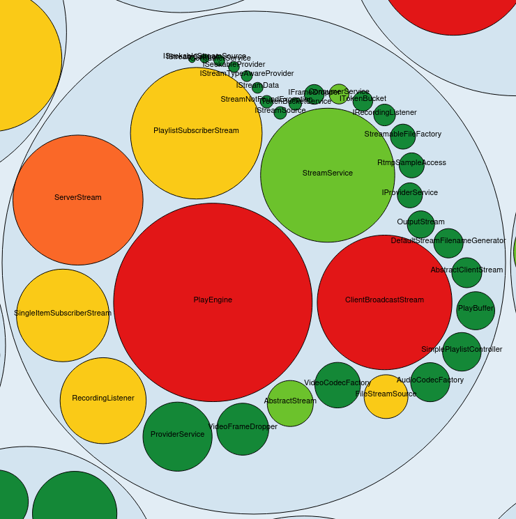

Le package stream est contenu dans le package principal red5-server-common, 
et la classe la plus appelée dans tout le projetest la classe `RTMPConnection`, elle est utilisée à la fois en interne par d'autres composants du projet et probablement de manière externe par des applications tierces qui utilisent red5-server pour la diffusion en continu., .
RTMPConnection est probablement responsable de l'établissement et de la gestion des connexions RTMP (Real-Time Messaging Protocol), qui sont couramment utilisées pour le streaming de contenu multimédia en temps réel sur Internet. Cette classe est donc cruciale pour la fonctionnalité de streaming de red5-server.
comme le package stream est contenu dans le package principal red5-server-common. Cela suggère une structure modulaire où red5-server-common agit comme un conteneur principal pour les fonctionnalités communes, y compris la gestion des flux (stream).
Cette constatation est logique car le package qui gère le stream est considéré comme étant le cœur du projet. Pour gérer le son, l'audio et le streaming, il est nécessaire d'avoir une classe principale, et RTMPConnection remplit cette fonction.
Les composants qui utilisent RTMPConnection pour gérer le streaming sont étroitement liés à cette classe et sont donc fortement couplés avec elle.

### 3.4 - Organisation des classes

<!-- Peut être mettre ca au début de la partie 3 ? -->
Tout d'abord afin de mieux comprendre les schémas qui vont suivre voici la légende des couleurs présentent.
|  |
|:--:|
| *La signification des couleurs dans les diagrammes* |

Voici deux définitions des métriques utilisées pour l'analyse de l'organisations des classes.

Depth of Inheritance Tree (DIT):

Attributs de qualité associés: `complexité`
> La position de la classe dans l'arbre d'héritage. A une valeur 0 (zéro) pour les classes racine et non héritées. Pour l’héritage multiple, la métrique indique la longueur maximale. Classe plus profonde dans l'arbre d'héritage, hérite probablement. Il est donc plus difficile de prédire son comportement. Cette classe est également relativement complexe à développer, tester et maintenir.

Number of Children (NOC):

Attributs de qualité associés: `Couplage`
> Le nombre de sous-classes directes d'une classe. La taille de NOC indique approximativement comment une application se réutilise. On suppose que plus une classe compte d'enfants, plus le responsable de la classe a la responsabilité de ne pas perturber le comportement des enfants. En conséquence, il est plus difficile de modifier la classe et nécessite davantage de tests.

|  |
|:--:|
| *Depth of Inheritance Tree (DIT)* |

On peut constater dans le diagramme ci-dessus qu'une grande partie du projet (585 classes soit 84%) a un très faible niveaux dans l'arbre d'héritage. Cela est considéré comme une bonne pratique dans le développement logiciel. Cela favorise une meilleure modularité, une maintenance plus facile et une réduction du couplage entre les classes.Cependant certaines partie du projet on un indicateur moyennement bas (45 classes soit 14.9%) et seulement 4 classes ont un indicateur moyen.
Nous allons étudier les classes ayant un indicateur élevé.

<!-- TODO -->

<!-- - La hiérarchie des classes :

- La profondeur de l’arbre d’héritage (DIT ) :

- Le nombre d’enfants par classes (min, max ou moyenne) (NOC ) :

- La stabilité des classes en général ou de quelques unes en particulier :

- La cohésion des classes au sein d’un paquetage en particulier : -->

## 4 - Analyse approfondie

### 4.1 - Tests 

- Le nombre de tests:
Il est intéressant de remarquer que  dans le projet on nous dit de skip les tests, et de ce fait on a 0 tests qui passent alors qu'ils ont bel et bien fait des tests !
Il est crucial pour tout projet logiciel d'avoir une suite de tests robuste pour garantir le bon fonctionnement du code.
par la suite on remarque qu'on a 144 classes de test,
et 172 JUnit test methodes.
Dans le cas du projet Red5-Server, il est noté que la commande pour exécuter les tests est configurée pour les ignorer (`mvn -Dmaven.test.skip=true`).
Cela signifie que les tests sont volontairement ignorés lors de la compilation et de l'exécution du projet. Par conséquent, aucun test unitaire n'est actuellement exécuté.
Mais, en tentant tout de meme de les exécuter,
en compilant et exécutant le projet on obtient:

_____________________________________________________________________________________________
  - Red5 .............................................. ........SUCCESS [  0.009 s]
  - [INFO] Red5 :: IO ......................................... SUCCESS [  8.696 s]
  - [INFO] Red5 :: Server Common .............................. SUCCESS [  5.060 s]
  - [INFO] Red5 :: Service .................................... SUCCESS [  0.290 s]
  - [INFO] Red5 :: Server ..................................... FAILURE [  1.069 s]
  - [INFO] Red5 :: Client ..................................... SKIPPED
_____________________________________________________________________________________________

- 66 classes de tests dans red5-client, et 16 JUnit methodes
test.
- 5 classes de tests dans red5-server-common et 21 JUnit methodes test, c'est très peu pour ce package car c'est quand meme le package principal et ou il y a le plus de couplage avec les autres packages, donc plus de tests seraient les bienvenus.
- 31 classes de tests dans red5-io et 92 JUnit methodes test.
- 42 classes de tests dans red5-server et 43 JUnit methodes test (ce sont ces tests qui échouent).
- Tandis que dans red5-service il y a 0 classes de tests et 0 methodes JUnit test.

- On a les tests de IO, Server Common et Service qui passent, contrairement à ceux de Server qui échouent ,
- Concernant le dossier Client ils ont été skip car dans les tests ils ont mis une variable pour expressement skip les tests.
Pour le package red5-service ils n'ont effectué aucun test.
- La couverture de tests :
Couverture de tests très faible (7.38%),
puisque les tests ont été ignorés (skip), il n'est pas vraiment possible de déterminer la couverture des tests exacte,
il y a des tests quasiment vides et donc on optera plutot pour l'analyse du code que l'analyse des tests en profondeur ( car il n'y en a quasiment pas !! ) sur 31k lignes de code.
Ce qui est tout de meme dommage !

- Le type de tests : unitaires, ils visent à tester des unités de code individuelles de manière isolée.

- Les tests passent:
On nous a dit de skip, mais la majorité des tests passent bien oui,
concernant les commentaires on avait remarqué que plein de tests ont été commentés ( probablement car ils ne passaient pas),ou bien ils peuvent tout simplement ne pas être à jour ou ne pas passer avec la version actuelle du code.
le seul qui ne passe pas est : testAttributeBlastingWithPrimitive.

- Nombre de bugs : le nombre total de bugs dans le projet est de 230 !
C'est énorme, mais pour un projet pareil je pense que c'est cohérent,
depuis le temps c'est vrai qu'ils auraient pu corriger les bugs.
mais il est tout de meme nécessaire d'avoir une suite de tests solide pour détecter et corriger les bugs existants, ainsi que pour prévenir l'introduction de nouveaux bugs lors du développement de nouvelles fonctionnalités ou de modifications du code existant.

- Niveau sécurité ça laisse à désirer, on a une note de E niveau sécurité.

La gestion des tests dans le projet est insuffisante et pas du tout satisfaisante,
des tests désactivés, ignorés, commentés,
des tests manquants voire inexistants, ce qui peut compromettre la qualité et la fiabilité du logiciel final.
Il faudrait améliorer la qualité des tests.

### 4.2 - Commentaires 
Sur tout le projet, on a remarqué qu'il y avait un ratio de 35.96% de commentaires,

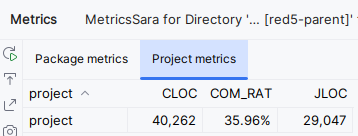

- le nombre de lignes de commentaires : concernant les commentaires on avait remarqué que plein de tests ont été commentés ( probablement car ils ne passaient pas),
Dans le projet red5-parent il y a au total 40262 lignes de codes commentés (CLOC), 
répartis comme cela : 
   - red5-client : 1737 CLOC avec un ratio de 23.30% commentaires
   - red5-io : 10199 CLOC avec un ratio de 35.92 % commentaires
   - red5-server : 8768 CLOC avec un ratio de 28.49% commentaires
   - red5-server-common : 19096 CLOC avec un ratio de 45.72% commentaires
   - red5-service : 389 CLOC avec un ratio de 24.81% commentaires
On remarque que le package ou il y a le plus de commentaires est red-server-common, d'un point de vue logique c'est normal car c'est le package qui contient le plus de classes (337), 

- le type de commentaire: 
Il existe de nombreux types de commentaires répértoriés dans notre projet, on relève notamment
de la javadoc, soit une courte description sur la fonctionnalité de la classe, soit une documentation assez détaillée pour l'utilisateur.
de la Licence, chaque fichier comporte d’ailleurs un entête de licence,
ou sinon du code commenté ce qui n’est pas pratique car il vaut mieux utiliser un système de gestion de version pour récupérer le code des anciennes versions.

 donc on a : 29044 (JLOC) Javadoc sur tout le projet, dont :
   - red5-client : 951 JLOC sur 1737 CLOC, c'est le package qui a le plus de javadoc 
   - red5-io : 7302 JLOC sur 10199 CLOC
   - red5-server : 5218 JLOC sur 8768 CLOC
   - red5-server-common : 15416 JLOC sur 19096 CLOC
   - red5-service : 157 JLOC sur  389 CLOC

 ensuite on a également du code commenté, licence et commentaires
pertinents.

- les parties sans commentaires :
les tests et des parties de codes sur les codecs
pour le nombre total de lignes de codes pas commenté, on a 71039 (NCLOC)
pour le nombre total de lignes de tests pas commenté, on 6557 (NCLOCt)

### 4.3 - Dépréciation 

- les bouts de code dépréciés (classes, méthodes) :
Dans notre projet on a répértorié plusieurs warnings et bouts de codes dépréciés :

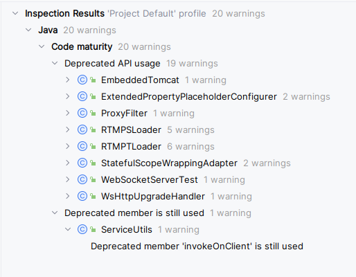

L’analyse avec IntelliJ montre la présence de bouts de code dépréciés, et la façon de comment le fixer.

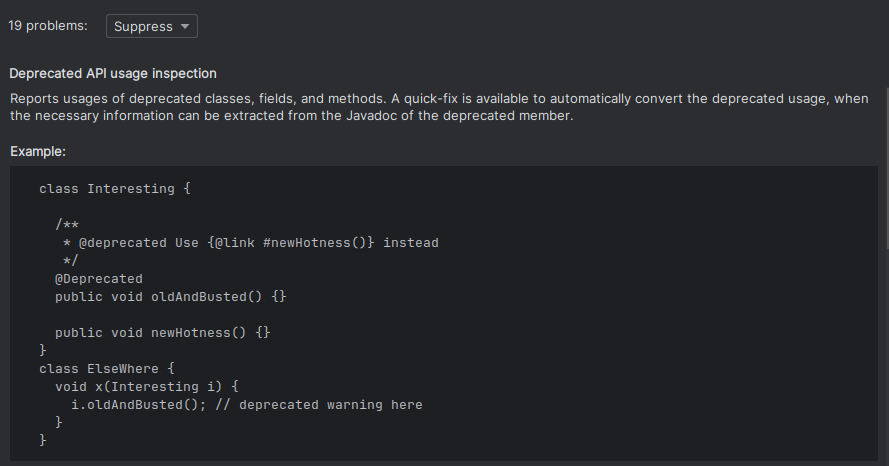

Et la façon dont on peut le corriger : 

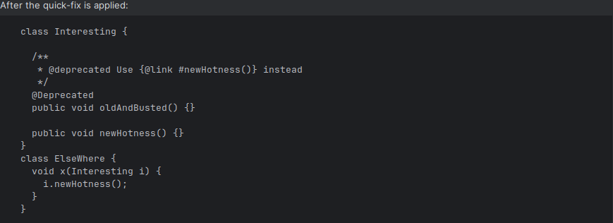

- les appels à du code déprécié :
Cela signifie que dans le projet certaines classes, y compris les méthodes, utilisent une version de code "dépassée" et donc dépréciée, pouvant compromettre la qualité ainsi que le bon fonctionnement du code non déprécié et donc du module.
l'utilisation de code déprécié n'a probablement pas
d’impact sur l'ensemble du projet car non utilisé, mais pour une bonne pratique de programmation, il peut être judicieux de remplacer ce code par une version plus à jour.

- Code déprécié toujours utilisé : 

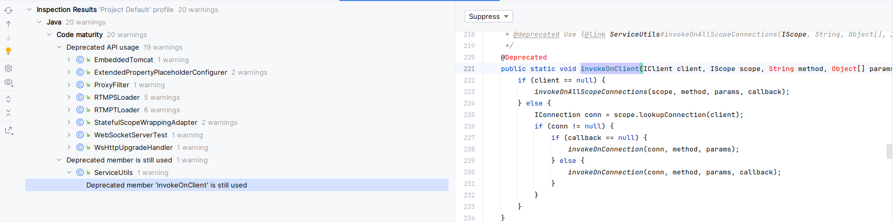
On pourrait par exemple corriger ce code déprécié en utilisanr la méthode recommandée `ServiceUtils#invokeOnAllScopeConnections`, on peut simplement remplacer l'appel à `invokeOnAllScopeConnections` dans la méthode `invokeOnClient`.
Voici d'ailleurs la méthode corrigée : 
_____________________________________________________________________________________________
    /**
    * Invoke a method on all connections of a client to a given scope and handle result.
    *
    * @param client
    *            client to get connections for
    * @param scope
    *            scope to get connections of the client from
    * @param method
    *            name of the method to invoke
    * @param params
    *            parameters to pass to the method
    * @param callback
    *            object to notify when result is received
    */
    public static void invokeOnClient(IClient client, IScope scope, String method, Object[] params, IPendingServiceCallback callback) {
        ServiceUtils.invokeOnAllScopeConnections(scope, method, params, callback);
    }
_____________________________________________________________________________________________

On a également : 

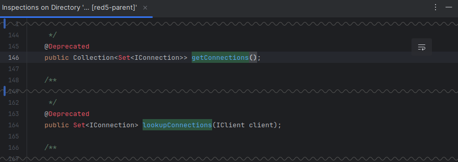
   
   

### 4.4 - Duplication du code

Dans l'ensemble des modules le code dupliqué représente seulement 4% soit 57k de lignes de code dupliquées et 161 blocs dupliqués.

| 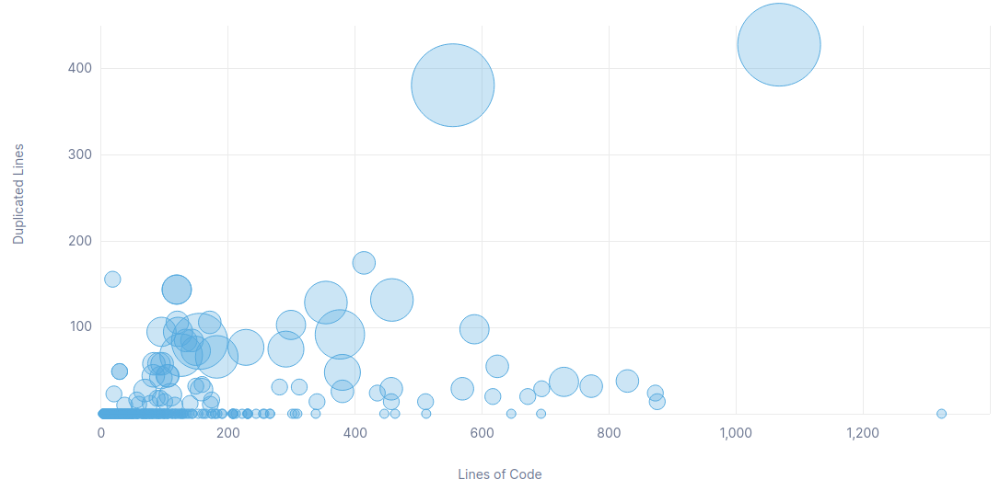 |
|:--:|
| *Graphique des lignes de code dupliquées* |

On peut constater qu'une grande partie du code ne comporte pas de ligne dupliquée mais 2 gros points très distinct peuvent être observés. En analysant le code correspondant aux 2 gros points on remarque que ceux sont 2 classes très similaires. Il s'agit des classes `/io/m4a/impl/M4AReader.java` et `io/mp4/impl/MP4Reader.java` qui ont un fonctionnement très similaire et qui pourrait être amélioré avec une classe parente commune par exemple afin de ne plus avoir de code dupliqué.

Le reste des points beaucoup moins gros en terme de lignes dupliquées mais présent en plus grand nombre représentent des codecs audio qui ont comme pour le cas au dessus des codes très similaire qui pourraient être encore plus généralisé qu'ils ne le sont déjà en améliorant la classe parente commune.

### 4.5 - God Classes

- le nombre de méthodes par classe (min, max, moyenne, médiane) :

- le nombre de variables d’instances par classe (min, max, moyenne, médi-
ane). Comparaison avec les résultats trouvés à la question précédente :

- le nombre de lignes de code par classe (min, max, moyenne, médiane),
Comparaison avec les résultats trouvés à la question précédente :

- les gods classes :

### 4.6 - Analyse des méthodes

- la complexité cyclomatique des méthodes en général ou de quelques unes
en particulier (avec min, max, moyenne, médiane) :

- les commentaires. Les commentaires sont-ils bien placés (les méthodes
avec une plus grande complexité cyclomatique ont elles également le plus grand
nombre de lignes de commentaire) :

- le nombre de lignes de codes des méthodes (avec min, max, moyenne,
médiane) :

## 5 - Nettoyage de Code et Code smells

### 5.1 - Règles de nommage [Sara]

Le nom des packages est bien choisi, simple et efficace , on comprend qu'il y a un dossier Server qui gère les servers, un dossier client, un dossier IO pour les sockets, et Service pour les services que propose le logiciel.
De manière toute aussi générale, les noms de la majorité des classes respectent les conventions de nommage des classe Java.
Sauf qu'il y a tout de meme des exceptions :

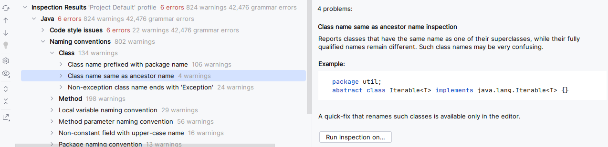

Effectivement, si une classe porte le meme nom que l'une de ses super-classes, ça pourrait porter à confusion et rendre le code difficile à lire et à comprendre.
9a pourrait conduire les développeurs qui travaillent dessus à modifier le mauvaid code et donc conduire à des erreurs, cela viole le principe de clarté car le nom d'une classe doit etre simple et descriptif, or que si on a deux classes qui portent le meme nom c'est difficile à comprendre, ça rend également la maintenance plus difficile car les développeurs prendraient plus de temps à repérer la bonne classe avec le bon nom.
Comme ça peut poser des problèmes d'héritage si on fait hériter la mauvaise classe.

On a aussi ce cas de figure :

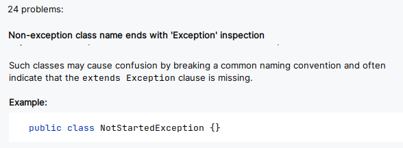

Le suffixe Exception est généralement utilisé lorsqu'une classe gère une exception, ce qui n'est visiblement pas le cas ici, alors cela pourrait porter à confusion et ça viole les règles de nommage des classe.
ça pourrait entrainer une mauvaise interprétation de la fonctionnalité de la classe, en pensant que celle-ci gère les exceptions ou les erreurs et induire en erreur les développeurs, il serait donc plus judicieux de réfactoriser le nom de cette classe en un nom bref et descriptif de sa fonctionnalité principale.

Le nom d'une classe commence par une lettre majuscule suivie de lettres minuscules sans espaces. Mais aussi chaque nom de classe donne une idée de l'utilité de la classe elle-meme.

### 5.2 - Nombre magique

### 5.3 - Structure du code

### 5.4 - Code mort [Sara]

- Code Smells : 3000 !
méthodes vides,
méthodes / classes jamais appelées,
On doit les supprimer car ils prennent de la place et rendent la compréhension et la maintenance du code compliquées.

---------------------------------------------------------

## 6 - Amélioration possibles du projet [sara]

- Coder quelques tests en plus histoire d'avoir plus de couverture.
par exemple je pourrais essayer de faire un ou deux tests dans le package server-common.
- Décommenter des bouts commentés et essayer de les débuger.
- Supprimer le code déprécié et le remplacer par du bon code.
- Utiliser les dépendances déclarées et non utilisées dans le projet, et également déclarer les dépendances utilisées mais non déclarées.
- Faire un UML !
- Débugger quelques bugs sur les 230 bugs trouvés.
- Réorganiser une classe.
- Fusionner des classes.
- Supprimer des nombres magiques.

