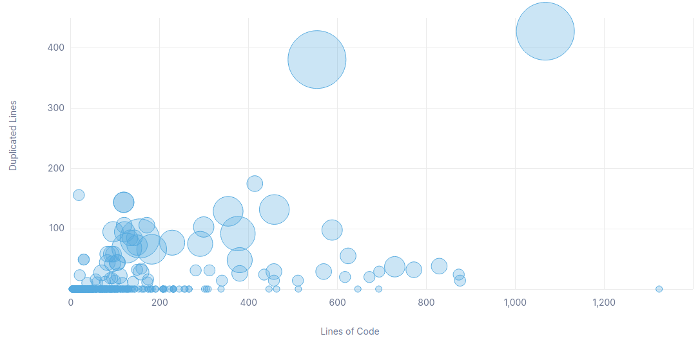

# Projet de GL

## Audit du projet

Sara Lyna OUYAHIA
Thibault TISSERAND

### Contexte

Analyse du projet [Red5-Server](https://github.com/Red5/red5-server)

### Présentation Globale du projet

#### Utilité du projet

Ce dépot contient le code source du projet Red5-Server. Il s'agit de:
Red5 est un serveur Flash gratuit et libre qui reprend les fonctionnalités de Flash Media Server de Adobe.

Il permet de faire du streaming audio ou vidéo, partage d'objet distant (remoting), de la synchronisation de données, etc. Contrairement à Flash Media Server 2, les applications côté serveur peuvent être écrites en Java mais aussi avec d’autres langages de script comme JavaScript, Ruby, Python, …

`english version`
Red5 is an Open Source Flash Server written in Java that supports:

- Streaming Video (FLV, F4V, MP4, 3GP)
- Streaming Audio (MP3, F4A, M4A, AAC)
- Recording Client Streams (FLV and AVC+AAC in FLV container)
- Shared Objects
- Live Stream Publishing
- Remoting
- Protocols: RTMP, RTMPT, RTMPS, and RTMPE

#### Description du projet

Le [readme](https://github.com/Red5/red5-server/blob/master/README.md) est pertinent et complet. Il contient une description du projet, les commandes maven pour installer et lancer le projet. Il contient aussi les commandes pour build le projet depuis la source ainsi que celle pour faire fonctionner le projet dans Eclipse. Une liste des anciennes versions est également disponible dans le readme.

La documentation est pertinente et complète. Elle se situe dans le [wiki](https://github.com/Red5/red5-server/wiki) du projet sur github.
Le wiki contient 23 catégories avec chacune des sous parties. Il y a des parties pour l'installation sous Linux et sous MacOS, pour les erreurs communes, les protocoles de transmission, pour un démarrage rapide avec le projet et une documentation sur la dernière version.

Le readme est pertinent, il y a les commandes essentielles pour faire marcher le projet telle la compilation et l'exécution.
To build the red5 jars, execute the following on the command line:

`mvn -Dmaven.test.skip=true install`
This will create the jars in the "target" directory of the workspace; this will also skip the unit tests.

To package everything up in an assembly (tarball/zip):

`mvn -Dmaven.test.skip=true clean package -P assemble`

To build a milestone tarball:

`mvn -Dmilestone.version=1.0.7-M1 clean package -Pmilestone`

Create the eclipse project files, execute this within red5-server directory.
`mvn eclipse:eclipse`

le projet est bien décrit dans le readme, on sait exactement ce qu'il fait .
Il manque peut-etre l'UML mais rien de bien méchant.

### Historique du logiciel

#### Analyse du git

Nombre de contributeurs : 14
Sponsor du projet : Le projet ne possède aucun sponsor (ko-fi n'étant pas concidéré comme un sponsor)
Nombre de commits total : 622 (15/02/2024)
Issues : 36 (15/02/2024)
Pull-Request : 5

Le projet est toujours actif à l'heure d'aujourd'hui,le dernier commit date de 2 semaines, pour un porjet de cette envergure on peut dire qu'il est assez bien maintenu.

Au total il y a six branches distinctes,
master : la branche par défaut
bug/R5SI-786
dependabot/maven/org.springframework-spring-web-6.0.0
stable-release
epic/GROGU
circleci-project-setup

## Architecture logicielle

### Utilisation de bibliothèques extérieures

Le projet contient 117 bibliothèques exterieur

la différence entre les bibliothèques référencées et celles utilisées :

les bibliothèques réellement utilisées :

### Organisation en paquetages

Le projet possède 5 paquetages

les liens entre les paquetages :

Les noms des paquetages sont:

- client
- common
- io
- server
- service
- servlet

### Répartition des classes dans les paquetages

le nombre de classes par paquetage :

la répartition des classes dans les différents paquetages :

 le couplage et la cohésion au sein des paquetages de quelques uns en
particulier :

### Organisation des classes

la hiérarchie des classes :

la profondeur de l’arbre d’héritage (DIT ) :

le nombre d’enfants par classes (min, max ou moyenne) (NOC ) :

la stabilité des classes en général ou de quelques unes en particulier :

la cohésion des classes au sein d’un paquetage en particulier :

## Analyse approfondie

### Tests

le nombre de tests : 41

la couverture de tests : 4% sur 107K lignes

le type de tests : unitaires

les tests passent : tous sauf 1 (testAttributeBlastingWithPrimitive)

### Commentaires

le nombre de lignes de commentaires :

le type de commentaire: Javadoc, code commenté, licence, commentaire
pertinent :

Javadoc, code commentés, licence

Les parties sans commentaires :
les tests et des parties de codes sur les codecs

### Dépréciation

les bouts de code dépréciés (classes, méthodes) :

les appels à du code déprécié :

### Duplication du code

Le projet possède 4% de code dupliqué pour 107k lignes, parmi ce code dupliqué nous avons 4286 lignes, 161 bloques et 68 fichiers dupliqué.

On peut voir que la grande majorité du code dupliqué est lié aux formats audio et aux codecs audios. Par exemple les 2 classes contenant le plus de code dupliqué sont `/io/m4a/impl/M4AReader.java` et `io/mp4/impl/MP4Reader.java` qui font quasiment 

### God Classes

le nombre de méthodes par classe (min, max, moyenne, médiane) :

le nombre de variables d’instances par classe (min, max, moyenne, médi-
ane). Comparaison avec les résultats trouvés à la question précédente :

le nombre de lignes de code par classe (min, max, moyenne, médiane),
Comparaison avec les résultats trouvés à la question précédente :

les gods classes :

### Analyse des méthodes

la complexité cyclomatique des méthodes en général ou de quelques unes
en particulier (avec min, max, moyenne, médiane) :

les commentaires. Les commentaires sont-ils bien placés (les méthodes
avec une plus grande complexité cyclomatique ont elles également le plus grand
nombre de lignes de commentaire) :

le nombre de lignes de codes des méthodes (avec min, max, moyenne,
médiane) :

## Nettoyage de Code et Code smells

### Règles de nommage

### Nombre magique

### Structure du code

### Code mort

---------------------------------------------------------

## Partie 2 : Amélioration du projet

### Petites modifications

### Moyennes modifications

### Grandes modifications
